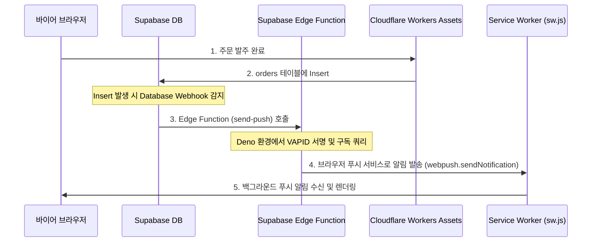

# 민들레 도매 주문 관리 시스템 포트폴리오 (Mindle Wholesale Order System Portfolio)

이 문서는 동대문 의류 도매 브랜드인 민들레의 도매 바이어와 관리자를 위한 풀스택 서버리스 주문 관리 플랫폼의 기술 스택, 아키텍처, 비즈니스 로직 및 보안 설계를 정리한 포트폴리오입니다.

---

## 1. 프로젝트 개요

동대문 의류 도매 시장의 특수한 비즈니스 도메인을 분석하여 설계된 전용 발주 및 주문 관리 시스템입니다. 일반적인 이커머스 쇼핑몰과 달리 도매 거래처 관리, 당일 재주문 시의 합배송 무료 처리, 패킹 과정에서 일부 품목 미입고 시 발생하는 미송(Backorder)의 자동 분리 및 이월 처리 등 도매 비즈니스에 필수적인 기능들을 완벽히 구현했습니다.

---

## 2. 개발 패러다임: 네이티브 AI 에이전트 개발 (Native AI Agent Development)

본 프로젝트는 인간 개발자가 도매 비즈니스 시나리오 기획 및 주문 흐름에 대한 최소한의 최종 검증(Human-in-the-loop)만을 수행하고, 실질적인 소프트웨어 아키텍처 설계, 구체적인 비즈니스 로직 구현, UI/UX 디자인, 상태 관리 컴포넌트 개발, 데이터베이스 보안(RLS) 및 RPC 프로시저 수립, 서드파티 이미지/알림 API 통합 연동, 배포 파이프라인 구축 및 컴파일 에러 디버깅 등 개발 공정 전반을 **AI 소프트웨어 엔지니어링 에이전트가 주도적으로 전담하여 자율 완수한 네이티브 AI 에이전트 개발(Native AI Agent Development)**의 모범 사례입니다.

* **인간 개발자의 역할**:
    * **도매 비즈니스 기능 요청**: 시장 도메인 분석에 따른 요구사항 기획 및 세부 기능 명세화
    * **배포 인프라 기획**: BaaS 및 Edge 플랫폼을 활용한 무중단 풀스택 서버리스 아키텍처 토대 수립
    * **형상 관리 및 배포 통제**: Git 버전 관리 제어 및 실서버 배포(Deploy) 작업 최종 승인 및 수행
* **AI 에이전트의 역할**:
    * **비즈니스 로직 및 컴포넌트 구현**: 데이터베이스 스키마([schema.sql](file:///Users/rami/Workspace/project/mindle_project/schema.sql)) 설계, React 컴포넌트 코딩 및 전반적인 다크모드/반응형 웹 UI/UX 디자인([index.css](file:///Users/rami/Workspace/project/mindle_project/src/index.css)) 작성
    * **배포 인프라 구현을 위한 로직 설계**: Cloudflare Workers 백엔드 서버 로직([src/worker.ts](file:///Users/rami/Workspace/project/mindle_project/src/worker.ts)), Deno 기반 Supabase Edge Function([supabase/functions/send-push/index.ts](file:///Users/rami/Workspace/project/mindle_project/supabase/functions/send-push/index.ts)) 및 표준 브라우저 서비스 워커 작성
    * **코드 검증 및 트러블슈팅**: 빌드 분석 및 번들 최적화 과정의 컴파일 에러 해결 및 버그 해결

이를 통해 1인 기획자가 실제 상용화 가능한 고품질의 풀스택 서버리스 어플리케이션을 단기간에 완벽하게 제작할 수 있는 현대적인 개발 방법론적 실증을 완료했습니다.

---

## 3. 폴더 및 파일 구조

프로젝트는 프론트엔드 빌드 결과물과 백엔드 엣지 API가 긴밀하게 통합된 구조로 설계되었습니다.

* [project/](file:///Users/rami/Workspace/project/mindle_project) : 프로젝트 루트 디렉토리
    * [wrangler.jsonc](file:///Users/rami/Workspace/project/mindle_project/wrangler.jsonc) : Cloudflare Workers 및 정적 자산(Assets) 바인딩 설정을 정의한 환경 설정 파일
    * [package.json](file:///Users/rami/Workspace/project/mindle_project/package.json) : 의존성 라이브러리 및 프로젝트 빌드/배포 스크립트 명세서
    * [schema.sql](file:///Users/rami/Workspace/project/mindle_project/schema.sql) : Supabase PostgreSQL 데이터베이스 스키마 및 RLS, RPC 정의 SQL 스크립트
    * [AGENT_GUIDE.md](file:///Users/rami/Workspace/project/mindle_project/AGENT_GUIDE.md) : 시스템 운영 및 유지보수를 위한 에이전트 가이드 가이드북
    * [src/](file:///Users/rami/Workspace/project/mindle_project/src) : 소스코드 메인 디렉토리
        * [worker.ts](file:///Users/rami/Workspace/project/mindle_project/src/worker.ts) : Cloudflare Workers 서버 엣지 엔트리포인트 파일. 이미지 업로드 중계 및 어드민 로그인 위임 API를 처리하며 정적 에셋 서빙을 분기
        * [main.tsx](file:///Users/rami/Workspace/project/mindle_project/src/main.tsx) : React 어플리케이션 구동 엔트리포인트 파일
        * [App.tsx](file:///Users/rami/Workspace/project/mindle_project/src/App.tsx) : 라우팅 구조 정의 및 레이아웃 제어 메인 컴포넌트
        * [index.css](file:///Users/rami/Workspace/project/mindle_project/src/index.css) : 디자인 시스템 토큰 및 전역 스타일 정의 스타일시트
        * [components/](file:///Users/rami/Workspace/project/mindle_project/src/components) : 단위 UI 컴포넌트 폴더
            * [OrderPage.tsx](file:///Users/rami/Workspace/project/mindle_project/src/components/OrderPage.tsx) : 바이어용 주문서 작성 페이지. 당일 재배송비 자동 계산 및 Daum 주소 API 연동
            * [MyOrdersPage.tsx](file:///Users/rami/Workspace/project/mindle_project/src/components/MyOrdersPage.tsx) : 바이어 본인의 주문 이력 및 진행 상황(배송/미송) 실시간 조회 페이지
            * [AdminPage.tsx](file:///Users/rami/Workspace/project/mindle_project/src/components/AdminPage.tsx) : 관리자용 통합 대시보드. 상품 CUD, 옵션 추가, 카테고리 관리 기능 탑재
            * [AdminOrdersPage.tsx](file:///Users/rami/Workspace/project/mindle_project/src/components/AdminOrdersPage.tsx) : 관리자용 주문 관리 페이지. 주문 상태 제어 및 미송 이월 처리
            * [AdminOrderCard.tsx](file:///Users/rami/Workspace/project/mindle_project/src/components/AdminOrderCard.tsx) : 개별 주문에 대응하는 인터랙티브 카드 컴포넌트
            * [AdminCustomersPage.tsx](file:///Users/rami/Workspace/project/mindle_project/src/components/AdminCustomersPage.tsx) : 거래처(바이어) 목록 및 잔여 미송 정보 관리 페이지
            * [ProductList.tsx](file:///Users/rami/Workspace/project/mindle_project/src/components/ProductList.tsx) 및 [ProductDetail.tsx](file:///Users/rami/Workspace/project/mindle_project/src/components/ProductDetail.tsx) : 카탈로그 및 상세 보기 컴포넌트
        * [store/](file:///Users/rami/Workspace/project/mindle_project/src/store) : 상태 관리 폴더
            * [useCartStore.ts](file:///Users/rami/Workspace/project/mindle_project/src/store/useCartStore.ts) : Zustand 기반 장바구니 전역 상태 관리 로직
        * [types/](file:///Users/rami/Workspace/project/mindle_project/src/types) : TypeScript 공통 타입 선언 폴더
            * [order.ts](file:///Users/rami/Workspace/project/mindle_project/src/types/order.ts) 및 [product.ts](file:///Users/rami/Workspace/project/mindle_project/src/types/product.ts) : 데이터 규격 모델 정의
    * [public/](file:///Users/rami/Workspace/project/mindle_project/public) : 정적 리소스 및 서비스 워커 폴더
        * [sw.js](file:///Users/rami/Workspace/project/mindle_project/public/sw.js) : 백그라운드에서 실시간 푸시를 수신하여 알림을 표시하는 W3C 표준 Service Worker
    * [supabase/](file:///Users/rami/Workspace/project/mindle_project/supabase) : Supabase 설정 및 확장 기능 폴더
        * [functions/send-push/index.ts](file:///Users/rami/Workspace/project/mindle_project/supabase/functions/send-push/index.ts) : DB 웹훅 신호를 받아 디바이스에 웹 푸시를 직접 발송하는 Deno 기반 Supabase Edge Function

---

## 4. 기술 스택 및 라이브러리

| 레이어 | 기술 및 라이브러리 | 용도 및 설명 |
| :--- | :--- | :--- |
| **프론트엔드 (Core)** | React 19, TypeScript, Vanilla CSS | 현대적인 컴포넌트 기반 웹 앱 구현 및 커스텀 스타일 제어 |
| **라우팅 / 상태 관리** | React Router DOM 7, Zustand 5 | 싱글 페이지 어플리케이션(SPA) 경로 전환 및 장바구니 상태 전역 동기화 |
| **빌드 도구** | Vite 8 | 초고속 HMR 지원 프론트엔드 빌더 및 환경 변수 처리 |
| **백엔드 (Edge API)** | Cloudflare Workers | Edge 런타임 상에서 작동하는 백엔드 API 서버 (V2 아키텍처) |
| **배포 / 인프라** | Cloudflare Workers Assets | 단일 서비스 워커 스레드로 프론트엔드 정적 파일과 백엔드 API를 동시 서빙 |
| **데이터베이스 / BaaS** | Supabase (PostgreSQL 15+) | 실시간 동기화, 사용자 권한 관리, 데이터 영속성 스토리지 |
| **실시간 알림** | Web Push API, Deno Webpush | 표준 웹 푸시 프로토콜 기반 백그라운드 푸시 알림 전송 |
| **외부 API 연동** | Kakao Daum 우편번호 API | 주소 검색 모달 창 연동을 통한 배송지 기입 표준화 |
| **이미지 호스팅** | ImgBB API | 상품 등록 시 업로드한 이미지를 Base64 형태로 넘겨받아 CDN 링크로 변환 및 호스팅 |

---

## 5. 핵심 아키텍처 및 개념

### 풀스택 서버리스 웹앱 (Full-stack Serverless Web App)
기존의 가상 서버나 상시 기동되는 컨테이너 서버를 구축하지 않고 모든 인프라를 가상화된 서버리스 자원으로 대체했습니다.
* **데이터 관리**: 관계형 데이터베이스로 Supabase(PostgreSQL)를 사용하며 백엔드 쿼리를 서버리스 클라이언트 SDK를 통해 직접 질의합니다.
* **비즈니스 로직**: 무거운 연산이나 타사 API 중계(관리자 로그인 위임, 이미지 업로드 중계 등)가 필요한 영역만 엣지 함수(Cloudflare Workers)로 분리해 처리하고, 데이터베이스 변경 이벤트 대응은 Supabase Edge Function(Deno)으로 연동했습니다.
* **운영 효율성**: 트래픽의 증감에 맞추어 인프라가 자동으로 확장(Auto-scaling)되므로 트래픽이 몰리는 동대문 밤/새벽 시간대에도 서버 과부하나 비용 낭비 없이 안정적으로 가동됩니다.

### 엣지 네이티브 웹앱 (Edge-Native Web App)
Cloudflare Workers Assets의 단일 인프라 모델을 적용하여 프론트엔드 정적 파일과 API 백엔드를 동일한 엣지 서버 환경 내에서 통합 작동시켰습니다.
* **단일 스레드 통합**: 클라이언트가 웹사이트에 접속하면 전 세계 분산된 엣지에서 가장 인접한 스레드가 React 정적 페이지를 반환하며, `/api/*` 경로의 요청 역시 동일한 스레드 내의 라우팅 분기를 통해 엣지 서버 로직으로 직접 전달됩니다.
* **속도 극대화**: 콜드 스타트가 거의 없는 경량 V8 엔진 기반의 Workers 환경을 차용해 초기 페이지 로드 타임과 API 응답 지연을 최저치(평균 10ms 수준)로 낮췄습니다.
* **도메인 통합**: 프론트엔드와 백엔드가 동일 도메인을 공유하므로 복잡한 CORS 설정의 부작용을 예방하고 네트워킹 리소스를 아낄 수 있습니다.

---

## 6. 핵심 비즈니스 로직 및 기능 구현

### KST 영업 주기 기준 당일 재주문 배송비 0원 자동화
도매 바이어들이 당일에 추가로 발주서를 넣을 때 배송비를 중복 부과하지 않고 자동으로 묶음 배송(합배송) 처리를 수행하는 편의 기능입니다. 동대문 도매업의 교대 및 마감 기준 시각인 **오전 4시**를 기준으로 영업 주기를 판단합니다.

> [!NOTE]
> **영업 주기 판별 및 조회 동작 구조**
> 1. 고객이 주문서 작성 중 전화번호를 조회하거나 기입할 때 스크립트가 실행됩니다.
> 2. 한국 표준시(KST)로 변환된 현재 시각을 구한 뒤 현재 시각의 시간이 `오전 4시 이전`인지 `오전 4시 이후`인지 판별합니다.
>    * **오전 4시 이전인 경우**: 시작 시간은 '어제 오전 4시', 종료 시간은 '오늘 오전 3시 59분 59초'로 세팅됩니다.
>    * **오전 4시 이후인 경우**: 시작 시간은 '오늘 오전 4시', 종료 시간은 '내일 오전 3시 59분 59초'로 세팅됩니다.
> 3. 이를 UTC 포맷의 시간대로 환산(9시간 차감)하여 Supabase 데이터베이스에 동일한 `customer_phone`을 가진 주문이 해당 기간 내에 존재하는지 개수를 쿼리합니다.
> 4. 만약 주문 이력이 존재한다면 배송비(3,000원)를 즉시 면제하고 화면에 **0원 (합배송 무료!)**을 표시하여 합배송을 자동 연동합니다.

```typescript
// src/components/OrderPage.tsx 내의 영업 주기 배송비 판별 함수 예시
const checkExistingOrderToday = async (phoneStr: string) => {
  const cleaned = phoneStr.replace(/\D/g, '');
  const now = new Date();
  const kstOffset = 9 * 60 * 60 * 1000;
  const kstTime = new Date(now.getTime() + kstOffset);
  const yyyy = kstTime.getUTCFullYear();
  const month = kstTime.getUTCMonth();
  const date = kstTime.getUTCDate();
  const hour = kstTime.getUTCHours();

  let cycleStartKST: Date;
  let cycleEndKST: Date;

  if (hour < 4) {
    cycleStartKST = new Date(Date.UTC(yyyy, month, date - 1, 4, 0, 0));
    cycleEndKST = new Date(Date.UTC(yyyy, month, date, 3, 59, 59, 999));
  } else {
    cycleStartKST = new Date(Date.UTC(yyyy, month, date, 4, 0, 0));
    cycleEndKST = new Date(Date.UTC(yyyy, month, date + 1, 3, 59, 59, 999));
  }

  const cycleStartUTC = new Date(cycleStartKST.getTime() - kstOffset);
  const cycleEndUTC = new Date(cycleEndKST.getTime() - kstOffset);

  const { count } = await supabase
    .from('orders')
    .select('*', { count: 'exact', head: true })
    .eq('customer_phone', cleaned)
    .gte('created_at', cycleStartUTC.toISOString())
    .lte('created_at', cycleEndUTC.toISOString());

  setHasExistingOrderToday((count || 0) > 0);
};
```

### 체크박스 기반 미송(Backorder) 분리 및 이월 자동화
도매 매장의 의류 유통 환경 특성상 주문한 상품의 일부 품목이 품절되거나 입고가 지연되는 경우가 빈번합니다. 이 경우 준비된 제품은 먼저 배송하고 준비되지 않은 제품은 자동으로 다음 차례로 미루어 관리하는 미송 처리 흐름을 지원합니다.

* **체크박스 검수**: 관리자가 포장 작업을 진행하며 준비가 완료된 품목만 체크박스를 통해 선택합니다.
* **주문서 분리 처리**: 주문의 최종 단계를 '포장 완료'로 변경할 때 백엔드에서는 다음과 같은 이중 기록을 보장합니다.
    * 체크된 상품들: 기존 주문서(`order_items`) 아래에서 상태가 `포장완료`로 업데이트됩니다.
    * 체크되지 않은 상품들: 기존 주문서 상에서 `미송` 상태로 변환되며, 해당 품목들의 정보와 수량, 가격을 고스란히 복제하여 새롭게 생성된 미송 마스터 주문서(`misong_orders` 및 `misong_order_items`)로 자동 분리 이월됩니다.
* **배송비 정책**: 이월되는 미송 주문서의 배송비는 자동으로 `0원` 처리되어 고객에게 추가적인 배송비 과금을 방지합니다.
* **정합성 롤백 설계**: 포장 작업을 번복하고 관리자가 이전 상태(주문 확인 등)로 상태를 되돌릴 경우, 기 생성되었던 미송 주문서 데이터를 DB 외래키 관계(Cascade) 설정을 활용해 완전 소멸시킴으로써 정밀한 트랜잭션 정합성을 실현합니다.

### 품절 및 일시품절 상품 노출 및 주문 제어 로직
이전에는 품절(is_deleted = true)되거나 노출이 중단(is_visible = false)된 상품은 바이어 쇼핑몰 화면에서 완전히 숨김 처리되었습니다. 그러나 바이어가 기존 상품 정보를 계속해서 확인하고 카탈로그를 탐색할 수 있도록, 상태에 따라 노출 방식을 세분화하여 개선하였습니다.

* **품절 상품 (`is_deleted === true`)**:
  - 쇼핑몰 상품 목록에 계속해서 노출되나 카드 전체가 `opacity: 0.6`으로 흐릿하게 처리됩니다.
  - 카드 표면 위를 대각선 줄로 질러 표시하며, 빨간색 `품절` 배지 오버레이를 띄워 상태를 시각적으로 전달합니다.
  - 상세보기 화면은 진입할 수 있으나, 장바구니 추가(+) 버튼 전체가 비활성화(disabled 및 `not-allowed` 마우스 포인터 처리)되어 주문이 불가능합니다.
* **일시품절 상품 및 옵션 (`is_visible === false`)**:
  - 상품 목록 및 옵션 리스트에 계속 노출하되 흐릿하게 처리되고, `일시품절` 배지 및 텍스트를 노출합니다.
  - 마찬가지로 상세 페이지 내 해당 상품 또는 해당 색상 옵션의 장바구니 추가 기능이 비활성화됩니다.
* **정합성 보장**:
  - 데이터베이스 스키마 상의 기존 상태 플래그(`is_deleted`, `is_visible`)를 그대로 유지하면서 클라이언트 쿼리 제약 조건을 유연하게 확장하고 UI 스타일과 이벤트 처리 제어로 비즈니스 요구사항을 신속하게 반영하였습니다.

### 베스트 상품 및 베스트 설정 실시간 노출 레이어
도매 상점의 주요 주력 상품들을 바이어에게 효과적으로 홍보하고 탐색을 유도하기 위해, 베스트 지정 어드민 워크플로우와 실시간으로 자동 재생되는 슬라이딩 쇼케이스 레이아웃을 구축했습니다.

* **어드민 지정 및 토글 워크플로우 (베스트 설정)**:
  - 관리자 대시보드([AdminPage.tsx](file:///Users/rami/Workspace/project/mindle_project/src/components/AdminPage.tsx))의 탭 바에서 '상품 관리', '상품 등록' 바로 뒤에 '베스트 설정' 버튼을 배치했습니다.
  - 해당 버튼 클릭 시 생성되는 모달(베스트 설정 모달)에서는 데이터베이스에 등록된 전체 활성 상품들을 실시간 검색 및 필터링할 수 있으며, 토글 버튼 하나로 각 상품의 베스트 지정 상태(`is_best` 필드)를 Supabase DB에 즉각 반영합니다. UI 표기는 모두 '베스트 설정'으로 일관되게 단축 및 변경하여 화면의 정돈감을 높였습니다.
* **무한 루프 마르퀴(Marquee) 슬라이더 및 최적화**:
  - 쇼핑몰 프론트엔드 첫 화면([ProductList.tsx](file:///Users/rami/Workspace/project/mindle_project/src/components/ProductList.tsx)) 상단에 베스트 상품 전용 레이어 영역을 추가했습니다.
  - 반응형 슬라이드 트리거 조건: 모바일 환경에서는 3개 이상, PC 환경에서는 5개 이상의 베스트 상품이 존재할 때 가로 방향 줄바꿈 없이(flex-wrap: nowrap) 좌측으로 끊김 없이 부드럽게 자동 회전하는 무한 마르퀴(Marquee) 슬라이더를 가동합니다.
  - 마우스 포인터를 상품 카드 위에 올릴 경우(Hover), 애니메이션의 일시정지(`animation-play-state: paused`) 기능을 제공합니다.
  - 조건 미달인 경우 움직이지 않고 화면 중앙에 정적 그리드로 정렬하여 균형을 유지합니다.
  - 카드 및 이미지의 규격을 일반 상품보다 약간만 더 크게 축소 조정(PC 너비 190px, 모바일 너비 125px)하여 세련된 연출을 도모하였고, 제목과 가격 사이의 불필요한 패딩 여백을 8px로 좁히고 세로 공간을 압축하여 컴팩트함을 더했습니다.
  - 슬라이더의 좌우 양 끝단 그라데이션 페이드 영역을 3%로 좁혀서 상품이 지나치게 흐려지는 영역을 방지하고 가시성을 향상시켰습니다.
* **반응형 Best 배지 오버레이**:
  - 베스트 상품으로 지정된 카드는 쇼케이스 영역 및 하단 메인 상품 목록 그리드 전체에서 이미지의 좌측 상단에 입체적인 엠버(Amber) 골드 그라데이션의 `Best` 배지가 중첩 표시됩니다.
  - 만약 해당 베스트 상품이 품절 또는 일시품절인 경우, 품절 안내 배지는 우측 상단으로 유동적으로 이동 배치되어 중요 배지 간의 겹침 현상을 원천 방지합니다.

### 상품 완전 삭제(Real Delete) 및 격리 보관 워크플로우
잘못 등록되었거나 비활성 상태 표시(품절/일시품절 등)만으로는 완전히 은닉하기 어려운 상품을 위해, 쇼핑몰 서비스 상에서는 노출되지 않도록 완전히 격리하되 데이터베이스와 관리자 단에서는 안전하게 보존하는 실체적 삭제 관리 플로우를 설계하고 구현했습니다.

* **완전 삭제 필터링 연동**:
  - 데이터베이스 `products` 테이블에 `is_real_deleted` 컬럼을 도입하고, 고객 쇼핑몰 화면([ProductList.tsx](file:///Users/rami/Workspace/project/mindle_project/src/components/ProductList.tsx)) 상의 메인 상품 목록 및 베스트 상품 목록 필터에 해당 플래그 검사를 연동하여 은닉을 자동화했습니다.
  - 상품 상세 정보 화면([ProductDetail.tsx](file:///Users/rami/Workspace/project/mindle_project/src/components/ProductDetail.tsx))에서도 동일한 검사를 수행하여 바이어가 강제로 URL을 입력해 접근하는 경로까지 보안 격리시켰습니다.
* **어드민 전용 '삭제된 상품' 탭 연동**:
  - 관리자 대시보드([AdminPage.tsx](file:///Users/rami/Workspace/project/mindle_project/src/components/AdminPage.tsx))에 '삭제된 상품' 전용 관리 탭을 새롭게 배치했습니다.
  - 관리자가 일반 상품 관리 리스트 및 품절 상품 관리 리스트의 카드 우측 하단에서 '완전 삭제' 버튼을 클릭하면, 상품 정보는 즉시 '삭제된 상품' 탭으로 이동 및 분류됩니다.
* **삭제 자산 복원 및 보호 조치**:
  - 삭제된 상품 카드에는 45% 불투명도 지정을 통해 극도로 비활성화된 시각 효과를 적용했으며, 오작동을 예방하기 위해 상품 상세 속성(카테고리, 설명, 가격 등) 및 하위 색상 옵션에 대한 수정/추가 폼을 일절 비활성화 처리했습니다.
  - 삭제된 상품 우측 하단의 '복원하기' 버튼을 활용해 상품을 언제든 안전하게 복구할 수 있으며, 복원 시 삭제 상태만 초기화되어 기존의 품절 여부 및 상세 설정을 그대로 유지한 상태로 원상 복구됩니다.

---


## 7. 보안 및 최적화 아키텍처

### 데이터베이스 RLS (Row Level Security) 및 관리자 세션 보안
Supabase의 행 단위 보안 필터(RLS) 정책을 프로젝트 전반의 테이블에 일관되게 적용하여 데이터 변조를 원천 봉쇄했습니다.
* **일반 바이어 권한**: 로그인 세션이 없어도 상품 목록 조회(SELECT) 및 자신의 정보 등록/주문서 기입(INSERT, UPDATE)은 비인증 공개 권한으로 허용합니다. 단, 임의로 타인의 정보를 삭제할 수는 없도록 구성했습니다.
* **관리자 권한**: 상품 정보의 추가/변경/삭제 및 주문 상태 수정 등 민감한 동작은 Supabase Authentication 상에서 인증된 관리자 역할(`authenticated`) 세션을 확인하는 RLS 정책인 `auth.role() = 'authenticated'` 검사를 통과해야만 수행되도록 DB 엔진 단에서 강제됩니다.

### RPC 기반의 비밀번호 검증 및 서버사이드 세션 매칭
관리자 비밀번호 유출 및 브라우저 클라이언트 측 해킹을 방지하기 위해 이중 보안 구조를 적용했습니다.

> [!IMPORTANT]
> **관리자 검증 절차 흐름**
> 1. 관리자가 입력한 임시 암호는 브라우저 단에서 Supabase 클라이언트 키로 직접 인증을 시도하지 않고, Cloudflare Workers의 어드민 로그인 API로 POST 전송됩니다.
> 2. Workers 백엔드는 안전한 환경 변수로부터 로드한 정보를 사용해 Supabase 데이터베이스 내부에 해시 암호 검증용 RPC 함수(`verify_admin_password`)를 격리 실행시킵니다.
> 3. 암호 해시 검증이 성공할 경우에만 백엔드 단에서 숨겨진 마스터 어드민 계정 정보로 Supabase 로그인(`signInWithPassword`)을 수행하고, 성공적으로 발급된 보안 JWT 세션을 클라이언트에게 최종 응답으로 주입합니다.
> 4. 이를 통해 클라이언트 브라우저 코드 내에는 관리자 계정의 자격 증명(이메일, 비밀번호 등)이 단 1바이트도 노출되지 않습니다.

### 비밀 환경 변수 은닉 전략
데이터베이스 마스터 정보 및 이미지 스토리지 업로드 키 등 외부 연동에 필요한 시크릿 키는 클라이언트 빌드 소스코드에 삽입하지 않았습니다.
* `IMGBB_API_KEY`, `ADMIN_EMAIL`, `ADMIN_PASSWORD` 등은 오직 Cloudflare Workers의 암호화된 내부 Secrets 환경 설정에 주입되어 있습니다.
* 클라이언트 브라우저는 이미지를 보낼 때 이미지 자체를 엣지 서버의 `/api/image/upload` 경로로 멀티파트 스트림으로 전달하고, 이미지 업로드는 엣지 서버 단에서 위 시크릿 키를 사용해 외부 스토리지 서비스로 안전하게 호출을 대행합니다.

### 브라우저 Canvas API 기반 이미지 리사이징 및 압축
모바일 네트워크 환경에서의 업로드 실패율을 최소화하고, 서버리스 함수의 실행 속도 단축 및 이미지 호스팅 서버의 가용 용량을 아끼기 위해 클라이언트 단 리사이징 기술을 사용했습니다.

* 사용자가 모바일로 고화질 의류 촬영 이미지를 첨부하면 업로드 전에 브라우저 내장 Canvas API를 활용해 최대 가로 1200px 규격으로 종횡비를 맞춰 실시간 스케일 다운을 적용합니다.
* 동시에 포맷을 JPEG로 변환하고 화질 품질을 75% 수준으로 줄이는 1차 인코딩 압축 작업을 거쳐 용량을 최대 90% 이상 획기적으로 축소한 후 이진 블롭(Blob) 데이터 상태로 FormData에 담아 API 서버에 전달합니다. 이후 이를 수신한 Workers 백엔드 내부에서 base64 스트림으로 최종 인코딩하여 ImgBB로 중계합니다.

---

## 8. 실시간 알림 파이프라인

바이어와 도매 매장 간의 신속한 의사소통을 돕기 위해 브라우저 웹 푸시(Web Push) 알림 인프라를 구축했습니다.



* **W3C 표준 Service Worker**:
    * 알림 표시를 위한 서비스 워커 [sw.js](file:///Users/rami/Workspace/project/mindle_project/public/sw.js)가 등록되어 백그라운드 스레드에서 브라우저가 꺼져 있어도 OS 수준의 알림 팝업 창을 안정적으로 표시합니다.
    * 수신받은 알림 데이터를 바탕으로 바이어가 클릭 시 자신의 주문 내역 페이지([MyOrdersPage.tsx](file:///Users/rami/Workspace/project/mindle_project/src/components/MyOrdersPage.tsx))로 다이렉트 딥링크(Deep Link) 이동 처리를 지원합니다.
* **서버리스 이벤트 트리거**:
    * 새로운 주문이 접수(Insert)되거나 포장 상태가 '포장 완료' 또는 '미송포장완료'로 변경(Update)되는 즉시 데이터베이스 단에서 웹훅(Database Webhook) 신호를 방출합니다.
    * 이 웹훅 신호가 Deno 런타임 기반의 Supabase Edge Function을 깨워 DB에 저장된 대상 기기의 Push Subscription 정보를 활용해 안전하게 암호화 서명(VAPID)된 알림을 동시 송출합니다.
* **유지보수형 구독 기기 자동 정리**:
    * 사용자가 브라우저 캐시를 지우거나 알림 권한을 취소하여 만료된 디바이스 정보가 잔존하는 경우, 푸시 전송 단계에서 발생하는 410(Gone) 혹은 404(Not Found) 응답 오류를 감지하여 유효하지 않은 구독 데이터를 즉시 DB 테이블에서 자동 삭제(Cleanup)하는 누수 방지 설계가 적용되어 있습니다.
