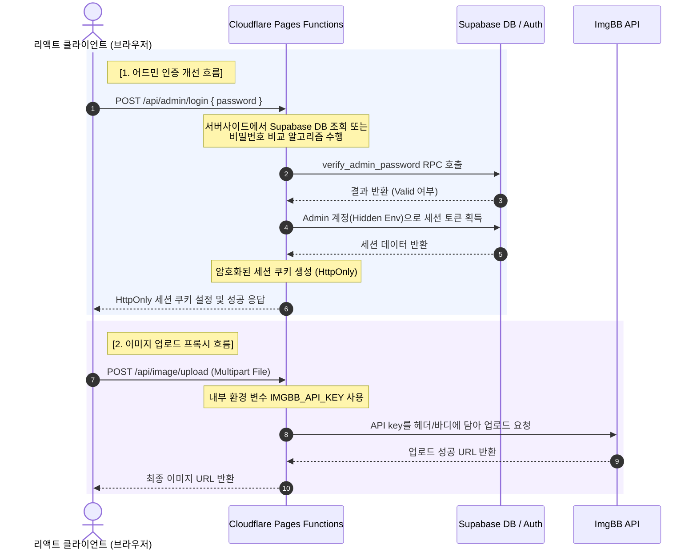

# Cloudflare Pages Functions 도입을 통한 백엔드 분리 및 보안 강화 구상안

현재 민들레 도매 주문 사이트는 React Single Page Application(SPA) 구조로 클라우드플레어 페이지스(Cloudflare Pages)에 배포되어 있으며, 데이터베이스 및 관리자 세션 관리를 위해 Supabase 클라이언트 SDK를 브라우저 상에서 직접 사용하고 있습니다. 

제안해주신 **Cloudflare Pages Functions**를 도입하는 아키텍처는 추가적인 서버 운영 비용 없이 보안 취약점을 차단하고 시스템 신뢰성을 극대화할 수 있는 매우 효과적인 해결책입니다. 이에 대한 타당성 검토와 구체적인 구현 방안을 아래와 같이 구상하여 제안합니다.

---

## 1. 현재 구조의 보안 취약점 분석

현재 `.env` 파일에 정의된 변수 중 `VITE_` 접두사가 붙은 환경 변수들은 Vite 빌드 타임에 클라이언트 측 JS 코드 내에 평문으로 치환되어 내장됩니다.
- **VITE_ADMIN_EMAIL** 및 **VITE_ADMIN_PASSWORD**: 어드민 세션을 열기 위해 Supabase Auth에 로그인할 때 사용되는 계정 정보로, JS 소스코드 분석을 통해 제3자에게 노출될 위험이 매우 큽니다.
- **VITE_IMGBB_API_KEY**: 이미지 업로드를 위해 클라이언트에서 직접 사용하는 API 키로, 브라우저의 네트워크 탭이나 JS 파일을 통해 쉽게 탈취될 수 있어 외부인의 악용 우려가 있습니다.

---

## 2. Cloudflare Pages Functions 기반 개선 아키텍처

클라우드플레어 페이지스는 프로젝트 루트에 `functions` 폴더를 생성하고 API 핸들러 코드를 위치시키면, 배포 시 자동으로 Cloudflare Workers 기반의 서버리스 엣지 함수(Edge Functions)로 빌드하여 `/api/*` 경로로 라우팅해 줍니다. 

이를 통해 민감한 환경 변수는 클라우드플레어 대시보드(혹은 `wrangler.jsonc` 환경 변수 관리)에만 등록하여 안전하게 은닉하고, 클라이언트는 서버리스 API 엔드포인트와만 통신하도록 구조를 변경할 수 있습니다.



---

## 3. 핵심 분리 대상 로직 및 함수화 상세 설계

### A. 어드민 인증 API (`/api/admin/login`)
- **역할**: 클라이언트에서 보낸 임시 비밀번호를 검증하고, 검증 성공 시 어드민 전용 토큰 또는 HttpOnly 세션 쿠키를 발급합니다.
- **경로**: `functions/api/admin/login.ts`
- **구현 방식**:
  1. 클라이언트가 제출한 비밀번호를 수신합니다.
  2. 서버리스 내부에서 환경 변수로 안전하게 은닉된 Supabase URL 및 Service Role Key를 활용하여 Supabase Client를 생성합니다.
  3. `verify_admin_password` RPC를 호출하여 비밀번호 일치 여부를 검증합니다.
  4. 일치하는 경우, 서버사이드 환경 변수인 `ADMIN_EMAIL`과 `ADMIN_PASSWORD`를 이용해 Supabase Auth 로그인을 수행하고 access_token을 가져옵니다.
  5. 획득한 세션 토큰을 `HttpOnly`, `Secure`, `SameSite=Strict` 옵션이 적용된 쿠키에 저장하여 클라이언트로 반환합니다. 클라이언트 자바스크립트는 이 쿠키를 읽거나 수정할 수 없으므로 XSS 공격으로부터 관리자 권한을 방어할 수 있습니다.

### B. 이미지 업로드 프록시 API (`/api/image/upload`)
- **역할**: ImgBB API Key 노출 없이 이미지를 안전하게 업로드합니다.
- **경로**: `functions/api/image/upload.ts`
- **구현 방식**:
  1. 클라이언트가 FormData 형식으로 이미지를 POST 요청합니다.
  2. 서버리스 함수 내부에서 `env.IMGBB_API_KEY`를 바인딩하여 ImgBB 업로드 엔드포인트(`https://api.imgbb.com/1/upload`)로 요청을 릴레이(Proxy)합니다.
  3. ImgBB로부터 반환받은 이미지의 direct link URL 주소를 클라이언트에 그대로 반환합니다.

### C. 어드민 전용 작업 권한 검증 미들웨어
- **역할**: 상품 등록, 수정, 삭제(블라인드), 주문 상태 업데이트 등 어드민 권한이 필요한 API 요청의 세션을 검증합니다.
- **경로**: `functions/api/admin/_middleware.ts`
- **구현 방식**:
  1. `/api/admin/*` 하위 경로로 들어오는 모든 요청에 대해 HttpOnly 쿠키의 세션 유효성을 서버사이드에서 먼저 검사합니다.
  2. 유효하지 않은 세션인 경우 `401 Unauthorized` 에러를 반환하여 무단 접근을 원천 차단합니다.

---

## 4. 프론트엔드 코드의 변경 사항

- **인증 방식 변경**:
  기존에 `import.meta.env.VITE_ADMIN_PASSWORD`를 참조하여 프론트엔드에서 수파베이스 로그인을 직접 처리하던 코드를 제거하고, 대신 `/api/admin/login` API 호출로 바꿉니다.
- **이미지 업로드 방식 변경**:
  기존 `AdminPage.tsx` 내의 ImgBB 직접 업로드 Fetch 요청을 로컬 API 경로인 `/api/image/upload` 호출로 단순화합니다.
- **API 프록시 설정 (Vite Dev Server)**:
  로컬 개발 시 `/api/*` 경로의 요청을 Wrangler 로컬 서버리스 환경으로 전달할 수 있도록 `vite.config.ts` 파일에 `server.proxy` 설정을 추가합니다.

---

## 5. 로컬 개발 및 빌드 파이프라인 구성

- **개발 환경 구동**:
  1. Wrangler CLI를 활용하여 로컬에서 Pages Functions를 시뮬레이션합니다.
     ```bash
     npx wrangler pages dev dist --compatibility-date=2026-06-03
     ```
  2. 로컬 테스트 및 개발 효율성을 위해 `npm run dev`와 Wrangler를 병렬로 띄우는 NPM 스크립트를 추가로 정의하여 활용할 수 있습니다.
- **배포 설정**:
  Cloudflare Pages 대시보드의 환경 변수 설정 화면에 `SUPABASE_URL`, `SUPABASE_SERVICE_ROLE_KEY`, `IMGBB_API_KEY`, `ADMIN_EMAIL`, `ADMIN_PASSWORD`를 등록합니다. 이후 GitHub 커밋 푸시 시 별도 조치 없이 프론트엔드 빌드 아티팩트(`dist`)와 `functions` API가 하나의 통합 애플리케이션으로 함께 배포됩니다.

---

## 6. 결론 및 제안

제안해주신 서버리스 Functions 기반의 백엔드 분리는 **보안 취약성을 완전히 해소하면서도 추가 비용이 발생하지 않는 최선의 아키텍처**입니다. 

이를 단계적으로 구현하기 위해 다음과 같은 마일스톤을 제안합니다.
1. **1단계**: `functions/api/image/upload.ts`를 작성하여 ImgBB API Key를 안전하게 격리하고, 프론트엔드 이미지 업로드 로직을 로컬 프록시 API로 전환합니다.
2. **2단계**: `functions/api/admin/login.ts`를 작성하여 어드민 패스워드 및 이메일을 숨기고 HttpOnly 쿠키 기반의 세션 인증 구조를 확립합니다.
3. **3단계**: 어드민이 수행하는 상품 추가, 수정, 삭제 등의 중요 API 엔드포인트를 추가로 분리하여 서버사이드 검증을 거치도록 보안을 점진적으로 강화합니다.
